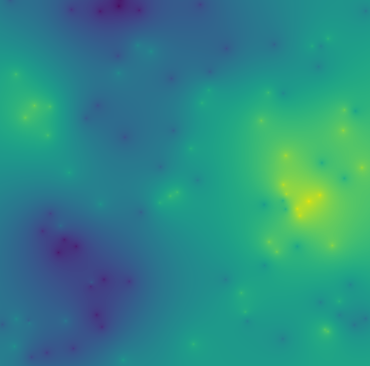

# HPC in Python

This repository contains examples of high performance computing techniques in
Python.

In the Jupyter notebook file [HPC.ipynb](HPC.ipynb) an example calculating the
potential field created by charged particles is used.
The example is implemented, and benchmarked, using several tools:

- Pure Python
- Numpy
- Numba
- Cython
- C++ (with pybind11)
- PyOpenCL
- PyCuda
- MPI

## Setup Instructions

To install using Conda, create a new virtual environment
and install the dependencies.

```shell
>> git clone https://github.com/hsaunders1904/PyHPC
>> conda create -n hpc python=3.7 -c conda-forge
>> conda activate hpc
>> conda install --file requirements.txt -c conda-forge
>> pip install ./PyHPC --no-deps
```

To use the C++, Cython, CpenCL or Cuda extensions,
you'll need a compiler e.g. Visual Studio on Windows, or g++ on Linux.

### OpenCL

To use the PyOpenCL functions you'll need to install the OpenCL runtimes for
your processor.

You can find the OpenCL runtimes for Intel processors and GPUs
[here](https://software.intel.com/content/www/us/en/develop/articles/opencl-drivers.html).
Note that there are 2 downloads here, one for the CPU and one for the GPU,
this package uses both.
You have to register for an account before downloading.

If you haven't got an Intel processor,
you'll have to Google for the relevant runtimes.

### Cuda

To use the Cuda extension, you'll need a Cuda compatible device
(e.g. an NVIDIA GPU), to install the
[Cuda toolkit](https://developer.nvidia.com/cuda-downloads),
and install `pycuda`.

#### Windows

As of time of writing there's no `pycuda` conda package for Windows.
Installing through `pip` should work:

```shell
>> pip install pycuda>=2021.1 --no-deps
```

#### Linux

There's a conda package for 64-bit `pycuda` on Linux,
so you can install it from `conda-forge`:

```shell
>> conda install pycuda>=2021.1 -c conda-forge
```

## Usage

After installation,
you can use the `calculate_grid` function to calculate the electric
potential generated by the given particles.
You can use any of the tools described above to do that.

```python
from pyhpc.plotting import plot_potential_grid
from pyhpc.potential import calculate_grid
from pyhpc.utils import gen_particles, gen_charges

num_particles = 150
particle_coords = gen_particles(num_particles, dist="random")
charges = gen_charges(num_particles)
grid_resolution = 1024

potential_grid = calculate_grid(
   particle_coords, grid_resolution, charges, func="cython"
)
plot_potential_grid(potential_grid)
```



For now, you can only run the MPI implementation from the command line:

```shell
>> mpiexec -n 4 python -m pyhpc.mpi 150 1024 --dist random --func cython
```

## Tests

To test your installation, install and run `pytest`.

```shell
>> conda install pytest -c conda-forge
>> pytest ./tests -k "not benchmarks"
```

This is a good way to validate everything is correctly installed and compiled.
